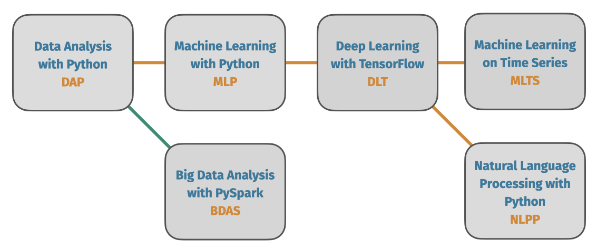

<div align="center">
  <h1>Data Science Learning Paths</h1>

  <p><b>Practical data science courses - from basic to intermediate</b></p>
 <a href="https://github.com/point8/data-science-learning-paths/blob/main/notebooks/data-science-learning-paths.ipynb"><b>Table of Contents</b></a>
</div>





## Have a look

[](https://mybinder.org/v2/gh/point8/data-science-learning-paths/HEAD)

_(Not everything is working using Binder, e.g. there is no Spark integration. We are working on it, but you should still get a good overview.)_


## Credits & Contributions

Course material developed by the team [@point8](https://github.com/point8) and [@clstaudt](https://github.com/clstaudt).

Contributions welcome! Have a look at [CONTRIBUTING.md](CONTRIBUTING.md)


## Development

We use [`pyenv`](https://github.com/pyenv/pyenv) and [`poetry`](https://github.com/python-poetry/poetry) to setup the python development environment.

After installing those two, run the following lines to be ready to develop:

```
pyenv install -s "$(cat .python-version)"
poetry env use "$(cat .python-version)"
poetry install
```

Now you can start your `jupyter-lab` UI with

```
poetry run jupyter-lab
```

or a classic `notebook` view with

```
poetry run jupyter notebook
```

### Working with on Apple Silicon M1 hardware

As there might occur some problems using the preferred setup on M1 hardware, you could also use [`conda`](https://github.com/conda-forge/miniforge).

As the leading system is poetry, please update the requirements file according to the dependencies in the `pyproject.toml`.

## Work with us

If you or your team wants to get an introduction into data science and machine learning or a deep dive into a special topic, we are there to support you! Just contact us by [email](mailto:trainings@point-8.de) and we will work out a fitting proposal.

## License

Copyright © 2018-2022 [Point 8 GmbH](https://point-8.de)

The training material in this repository is licensed under a Creative Commons BY-NC-SA 4.0 license. See [LICENSE](LICENSE) file for more information.
