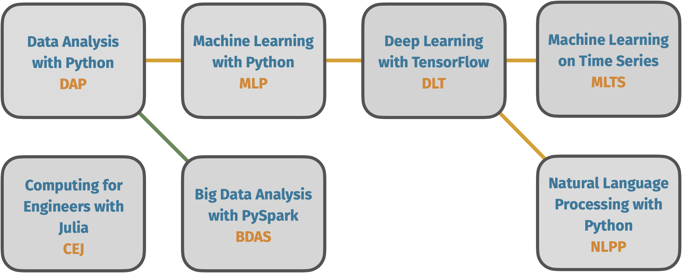

<div align="center">
  <h1>Data Science Learning Paths</h1>

  <p><b>Practical data science courses - from basic to intermediate</b></p>
 <a href="https://github.com/point8/data-science-learning-paths/blob/main/notebooks/data-science-learning-paths.ipynb"><b>Table of Contents</b></a>
</div>





## Have a look

[](https://mybinder.org/v2/gh/point8/data-science-learning-paths/HEAD)

_(Not everything is working using Binder, e.g. there is no Spark integration. We are working on it, but you should still get a good overview.)_


## Credits & Contributions

Course material developed by the team [@point8](https://github.com/point8) and [@clstaudt](https://github.com/clstaudt).

Contributions welcome! Have a look at [CONTRIBUTING.md](CONTRIBUTING.md)


## Development

We use [`uv`](https://docs.astral.sh/uv/) to manage the Python environment and dependencies.

After [installing uv](https://docs.astral.sh/uv/getting-started/installation/), run the following to set up the project:

```
uv sync
```

This will automatically install the required Python version and all dependencies.

To make the environment available as a Jupyter kernel, run:

```
uv run python -m ipykernel install --user --name data-science-learning-paths --display-name "Data Science Learning Paths"
```

Now you can start your `jupyter-lab` UI with

```
uv run jupyter lab
```

or a classic `notebook` view with

```
uv run jupyter notebook
```

## Work with us

If you or your team wants to get an introduction into data science and machine learning or a deep dive into a special topic, we are there to support you! Just contact us by [email](mailto:trainings@point-8.de) and we will work out a fitting proposal.

## License

Copyright © 2018-2024 [Point 8 GmbH](https://point-8.de)

The training material in this repository is licensed under a Creative Commons BY-NC-SA 4.0 license. See [LICENSE](LICENSE) file for more information.
